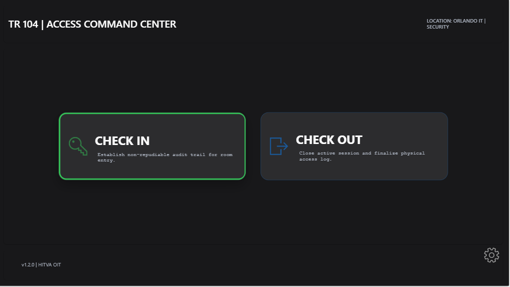
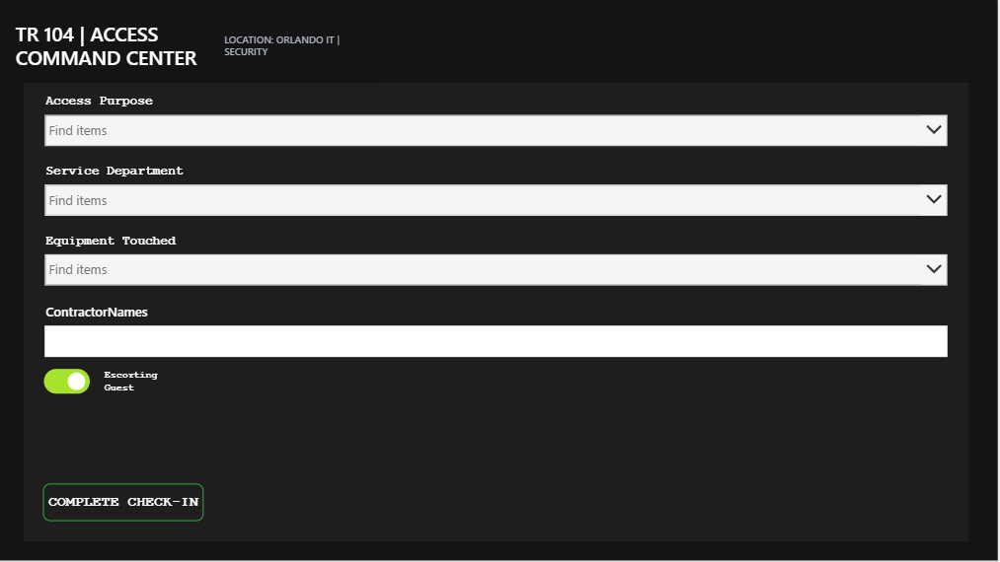
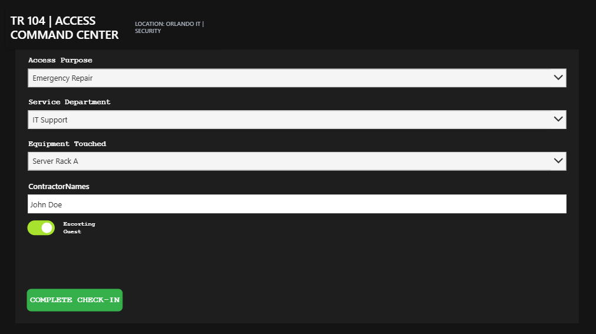
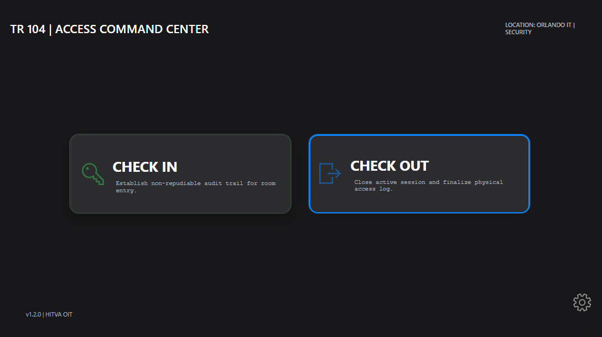
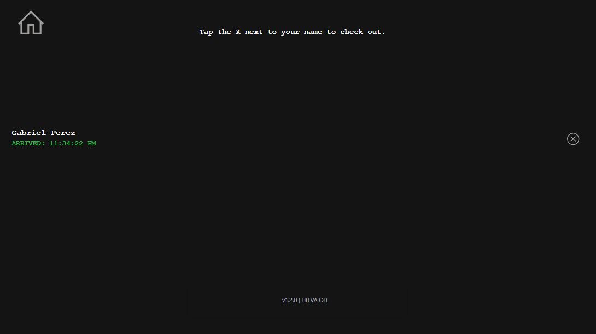
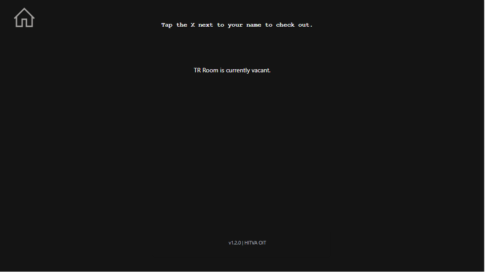
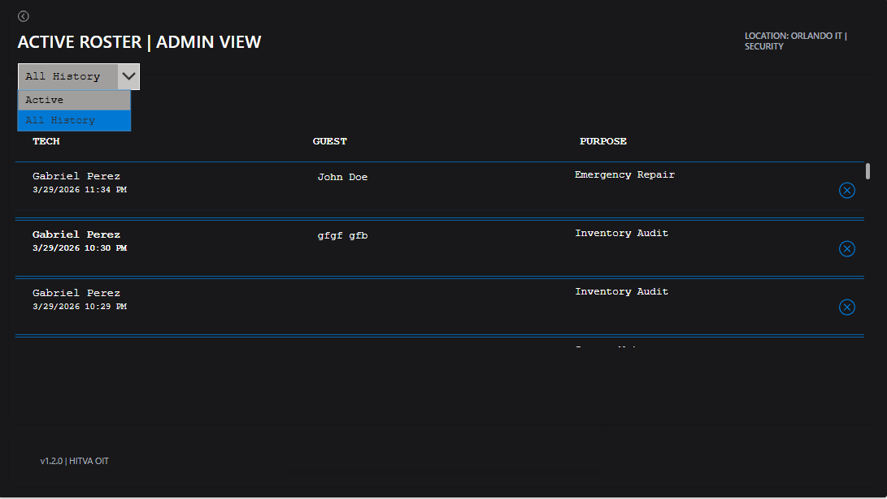

# Technical Room Access Log
### Secure Identity-Based Entry System

I developed this application to replace manual tracking methods with a secure, automated digital log. This project demonstrates how to use identity-based logic to manage facility access and maintain a clean audit trail for security compliance.

### Technical Implementation

* **Identity-Gated Access:** The app utilizes the Microsoft 365 login token to identify users automatically. This ensures all check-in data is tied to a verified identity without requiring manual input.
* **Administrative Security:** I implemented a visibility rule that checks the user's email against an authorized list. If a user is not an administrator, the settings and historical data logs are completely hidden from their view.
* **Real-Time Data Management:** Using Power Fx Patch functions, the app manages a live "Check-In/Check-Out" lifecycle. It updates existing database records in real-time to reflect when a user has departed the room.
* **Dynamic Filtering:** The "Active Roster" view is engineered to only show current occupants. I built a custom toggle for the Admin view that allows a supervisor to switch between "Live" and "All History" views instantly.

### Stack
* **Platform:** Microsoft Power Apps
* **Identity:** Entra ID (Azure AD)
* **Backend:** SharePoint / Dataverse
* **Logic:** Power Fx

* 
## Application Workflow

**1. Main Command Center**

**2. User Check-In Form**

**3. Data Entry Validation**

**4. Active Room Roster (Populated State)**

**5. User Check-Out Process**

**6. Active Room Roster (Empty State)**

**7. Identity-Gated Admin Audit Log**

##  How to Run & View the Logic

Since this is a Power App, it cannot be run directly as a live website from GitHub. To inspect the screens, formulas, and internal logic I built, Please follow these steps:

1. **Download the Source File:** Download the `TR Room Digital Access Log.msapp` file from this repository to your local machine.
2. **Open Power Apps Studio:** Log in to your environment at [make.powerapps.com](https://make.powerapps.com).
3. **Import the Application:**
   * Click **Apps** on the left-hand sidebar.
   * Select **New app** > **Canvas**.
   * In the studio, go to **Open** (the folder icon) and select **Browse files**.
4. **Load the File:** Select the `.msapp` file you downloaded.
5. **Review the Architecture:** Once loaded, you can explore the `Patch` functions, `Filter` logic, and the `Visible` property security rules used throughout the app.

*Note: This application was designed for a secure environment and requires a connected SharePoint or Dataverse list to write data. While the logic and UI are fully viewable, data writes will require a backend connection.*
